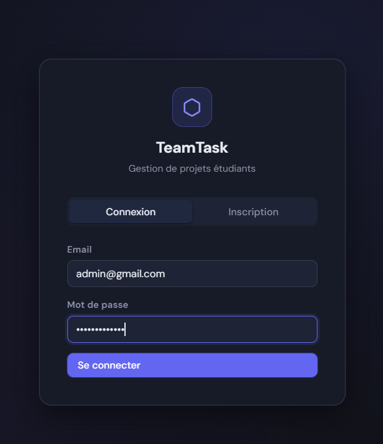
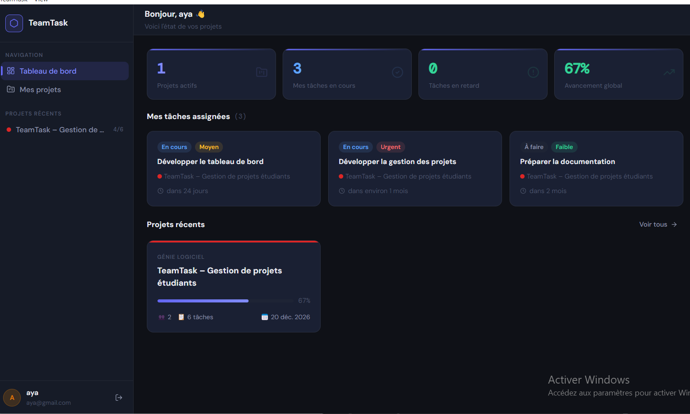
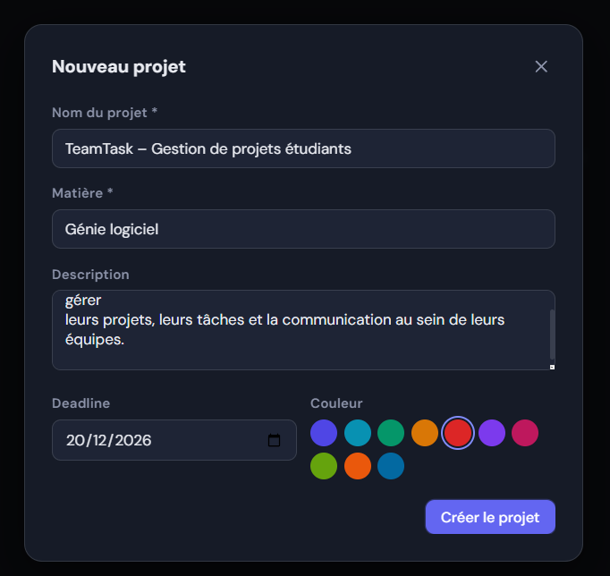
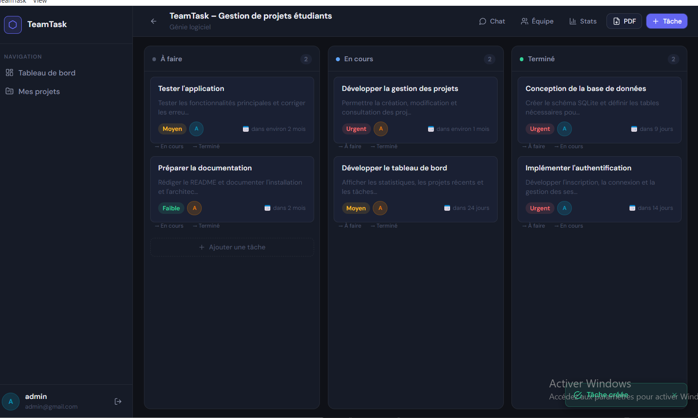
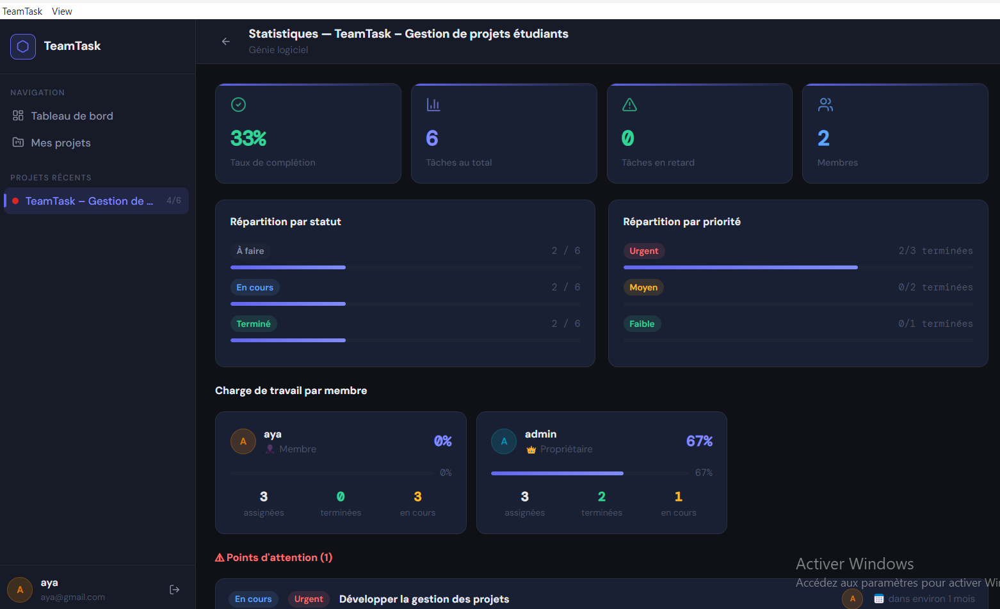
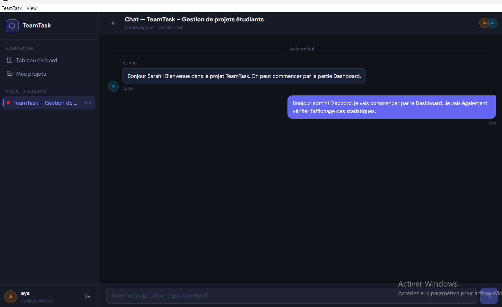

# ⬡ TeamTask

**TeamTask** is a desktop application for managing student projects and team collaboration.

It brings together project management, task tracking, team collaboration, messaging, and progress monitoring in a single desktop application.

**Tech stack:** React 18 · Vite · PHP · SQLite · Electron

---

## 📸 Screenshots

### 🔐 Authentication

Users can create an account and sign in to TeamTask.



### 📊 Dashboard

The dashboard provides an overview of projects, tasks, progress, and team activity.



### 📁 Project Creation

Projects can be created with a name, subject, description, deadline, and color.



### ✅ Task Management

Tasks can be created, assigned to team members, given priorities and deadlines, and tracked through their status.



### 📋 Project Status

The project status interface provides a visual way to follow task progression.



### 💬 Team Chat

Team members can communicate within the project through the integrated chat.




---

## ✨ Features

| Feature                     | Description                                                 |
| --------------------------- | ----------------------------------------------------------- |
| 🔐 **Authentication**       | User registration and login                                 |
| 📊 **Dashboard**            | Overview of projects, tasks, and progress                   |
| 📁 **Projects**             | Create, update, and manage projects                         |
| 📋 **Kanban Board**         | Organize tasks into To Do, In Progress, and Completed       |
| ✅ **Tasks**                 | Manage descriptions, priorities, deadlines, and assignments |
| 👥 **Team Management**      | Manage project members and team participation               |
| 💬 **Project Chat**         | Communication between project members                       |
| 📈 **Statistics**           | Visual overview of project and task progress                |
| 📄 **PDF Export**           | Generate printable project reports                          |
| 🖥️ **Desktop Application** | Runs as an Electron desktop application                     |

---

## 🛠️ Technology Stack

### Frontend

* React 18
* Vite
* JavaScript / JSX
* Axios
* CSS

### Backend

* PHP
* SQLite
* REST-style API endpoints

### Desktop

* Electron

### Development

* Node.js
* npm
* Git / GitHub

---

## 🏗️ Architecture

```text
┌─────────────────────────────────────────────┐
│              Electron Desktop App           │
│                                             │
│  ┌───────────────────────────────────────┐  │
│  │          React + Vite Frontend        │  │
│  │                                       │  │
│  │ Dashboard · Projects · Tasks · Team   │  │
│  │ Chat · Profile · Statistics           │  │
│  └───────────────────┬───────────────────┘  │
│                      │ HTTP / Axios         │
│  ┌───────────────────▼───────────────────┐  │
│  │              PHP Backend              │  │
│  │                                       │  │
│  │ Authentication · Projects · Tasks     │  │
│  │ Messages · Database Access            │  │
│  └───────────────────┬───────────────────┘  │
│                      │                      │
│  ┌───────────────────▼───────────────────┐  │
│  │               SQLite                  │  │
│  │            teamtask.db               │  │
│  └───────────────────────────────────────┘  │
└─────────────────────────────────────────────┘
```

---

## 📁 Project Structure

```text
teamtask/
│
├── electron/
│   ├── main.js
│   └── preload.js
│
├── backend/
│   ├── api/
│   │   ├── auth.php
│   │   ├── projects.php
│   │   ├── tasks.php
│   │   └── messages.php
│   │
│   ├── config/
│   │   └── db_connection.php
│   │
│   └── database.sql
│
├── database/
│   └── teamtask.db              # Generated locally
│
├── src/
│   ├── api/
│   │   ├── client.js
│   │   └── index.js
│   │
│   ├── components/
│   ├── context/
│   ├── hooks/
│   ├── pages/
│   ├── styles/
│   └── utils/
│
├── index.html
├── package.json
├── package-lock.json
└── vite.config.js
```

> `node_modules/` and generated build files are intentionally not included in the repository.

---

## 🚀 Getting Started

### Prerequisites

Make sure the following are installed:

* **Node.js 18 or newer**
* **npm 9 or newer**
* **PHP 8.0 or newer**
* Git

PHP must be available from your system `PATH`.

You can verify the installations with:

```bash
node --version
npm --version
php --version
git --version
```

---

## 📦 Installation

Clone the repository:

```bash
git clone https://github.com/AyaTech405/teamtask.git
cd teamtask
```

Install the JavaScript dependencies:

```bash
npm install
```

---

## ▶️ Development

Start the development environment with:

```bash
npm run dev
```

The exact development workflow depends on the scripts defined in `package.json`.

The frontend is expected to run through Vite, while the PHP backend is configured to use a local HTTP server.

If the project does not start correctly, verify that PHP is installed and available through the command line:

```bash
php --version
```

---

## 🌐 Backend

The PHP API is designed to run locally.

The default backend configuration uses:

```text
http://localhost:8000
```

The frontend API configuration is located in:

```text
src/api/client.js
```

The Electron process configuration is located in:

```text
electron/main.js
```

If the backend port is changed, the corresponding frontend API configuration must also be updated.

---

## 🗄️ Database

TeamTask uses **SQLite** for local data storage.

The database schema is provided in:

```text
backend/database.sql
```

The local database is stored in:

```text
database/teamtask.db
```

The database file is generated locally and should not contain real user credentials or private data when the project is published.

---

## 🏭 Production Build

Build the React application with:

```bash
npm run build
```

Electron packaging commands depend on the scripts configured in `package.json`.

Typical targets may include:

```bash
npm run pack:win
npm run pack:mac
npm run pack:linux
```

Before using these commands, verify that the corresponding scripts exist in `package.json`.

---

## 🔐 Security Notes

This project is intended as an academic / portfolio application.

It currently provides basic authentication and local data management, but it should **not be considered production-ready security software**.

Before deploying the application in a real production environment, additional security measures would be appropriate, including:

* Stronger session management
* CSRF protection where applicable
* Input validation and sanitization
* Rate limiting
* Secure production configuration
* More comprehensive authorization checks
* Secure secret management
* HTTPS for network deployments
* Additional authentication mechanisms such as 2FA

---

## ⚠️ Current Limitations

The current version is a student/portfolio MVP.

Known limitations include:

* 💬 **Chat:** uses HTTP polling rather than WebSockets
* 🖥️ **PHP dependency:** PHP must be available on the target machine unless the application is later packaged with an embedded PHP runtime
* 🔐 **Authentication:** basic email/password authentication
* 🔔 **Notifications:** currently limited to application-level UI feedback
* 🗄️ **Database:** SQLite is designed for local/small-scale usage rather than large multi-user deployments

---

## 🔧 Technical Notes

During development, several implementation issues were addressed.

### Electron routing

The application uses `HashRouter` so that frontend routes can work correctly when the Electron application loads local files.

This avoids the routing problems that can occur with `BrowserRouter` when the application is loaded through Electron's `file://` environment.

### PDF export

The PDF/report workflow was adjusted so that local application windows required by the export process are not unnecessarily blocked.

External HTTP/HTTPS links can still be handled separately from local application windows.

### Profile management

Profile-related operations were connected to backend API actions so that profile changes can be persisted rather than only displaying a success message.

### UI consistency

Several missing utility CSS classes were added to align the JSX components with the application's design system.

### HTML escaping

User-controlled text included in generated report HTML is escaped before being inserted into the document, reducing the risk of malformed HTML.

### Database cleanup

The repository does not include a pre-populated test database.

A clean local database can be generated from the provided schema when required.

---

## 📌 Development Status

**Current stage:** Academic / portfolio MVP

The project is being tested and refined before its final release.

Planned improvements may include:

* WebSocket-based real-time messaging
* Desktop notifications
* More advanced authentication
* Improved authorization
* Automated tests
* Better deployment and packaging
* Improved database architecture for larger deployments

---

## 🎓 Academic Context

TeamTask was developed as a practical software engineering project focused on:

* Desktop application development
* Frontend/backend integration
* REST API design
* Database management
* Authentication
* Project and task management
* Team collaboration
* Software architecture

---

## 📄 License

This project is currently intended for educational and portfolio purposes.
